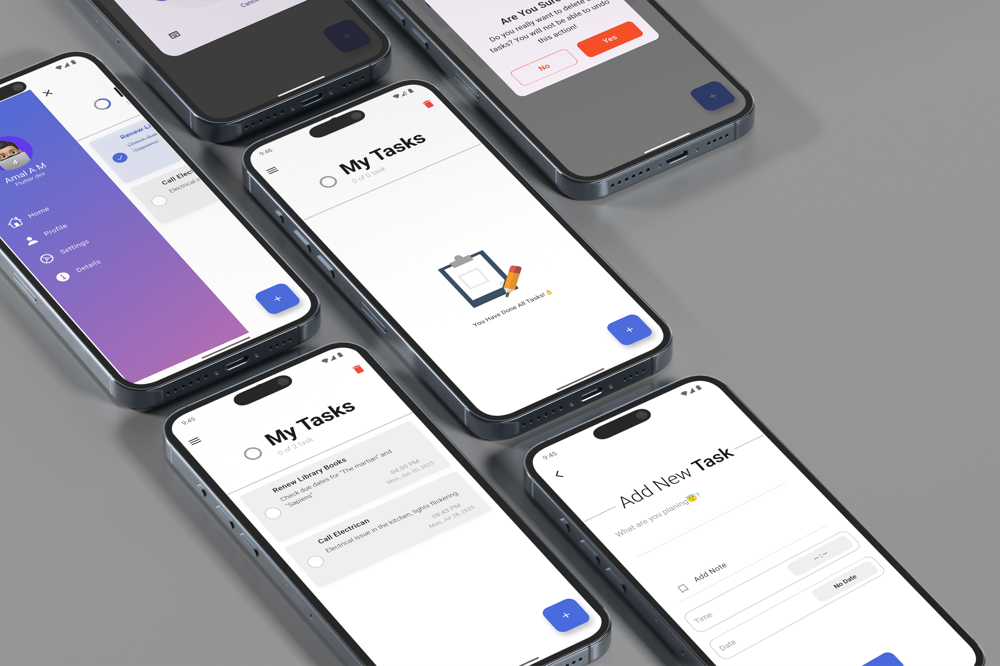

# TODO



A simple and intuitive **Flutter To-Do** application designed to help users manage tasks effectively.  
This app is fully responsive, supports task creation, editing, deletion, and categorization — perfect for productivity-focused users.

---

## Screenshots

<div align="center">
  
  
  
  
  
  
  
  
  
</div>

---

## Features

- Add, edit, and delete tasks
- Organize tasks by category or deadline
- Mark tasks as completed
- View active, upcoming, and finished tasks
- Clean, responsive UI using Flutter and Dart
- Offline support with **Hive DB**
- Smooth **animations** using Lottie and Animate Do
- Popup dialogs and reminders using **notifications**
- Beautiful sliders, drawers, and date pickers

---

## Getting Started

### Prerequisites

Ensure Flutter is installed on your system.  
To verify installation:

```bash
flutter doctor
```

## Clone the Repository

```bash
git clone https://github.com/Amal-AM4/Todo-Hive.git
cd todo-flutter-app
```

---

## Get Dependencies & Run the App

```bash
flutter pub get
flutter run
```

---

## Building for Android

```bash
flutter build apk --release
```

### License
This project is provided for educational and personal use.